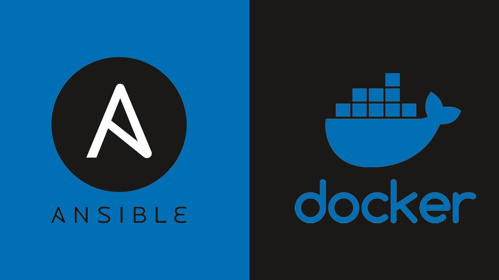

# 🐳 Ansible Role: Docker Installation & Configuration



This Ansible role automates the **installation and configuration of Docker**.  
It provides a reliable, repeatable, and scalable way to set up Docker across multiple systems.

---

## ✨ Features

- **Installs Docker** and required dependencies
- **Configure Docker daemon** options (e.g., storage drivers, exec options)  
- Ensure **Docker service is enabled & running**  
- Full **customization through role variables**  

---

## 📁 Project Structure

```
Ansible-Docker-Setup/
├── ansible.cfg
├── inventory
│   └── hosts.yml
├── playbooks
│   └── docker.yml
├── README.md
└── roles
    └── docker_setup
        ├── defaults
        │   └── main.yml
        ├── handlers
        │   └── main.yml
        ├── tasks
        │   ├── configuration.yml
        │   ├── installation.yml
        │   ├── main.yml
        │   └── preparing.yml
        └── templates/etc/
                      ├── apt/sources.list.d/docker-ce.list.j2
                      └── docker/daemon.json.j2
```

All variables used in this role are located in the default directory of the role. You can find and modify them in the `roles/docker_setup/defaults/main.yml`
These variables allow you to customize the Docker installation and configuration based on your requirements. Simply update the variables in this file to tailor the role's behavior to your environment.

---

## 📦 Example Playbook

You can use the Docker role in a playbook like the example below to install and configure Docker:

```yaml
- name: install and configuration docker
  hosts: all
  become: true
  gather_facts: true
  roles:
    - ../roles/docker_setup
```

---

## 👤 Author

**Parsa Hosseinzadeh**  
Linux Administrator & Security Enthusiast  
GitHub: [hosseinzadeh-parsa](https://github.com/hosseinzadeh-parsa)